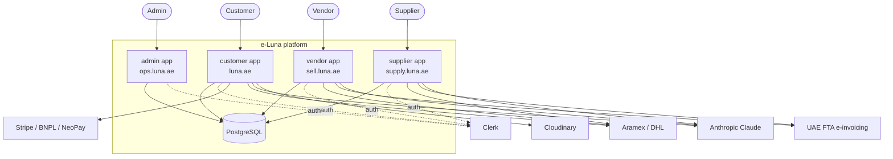
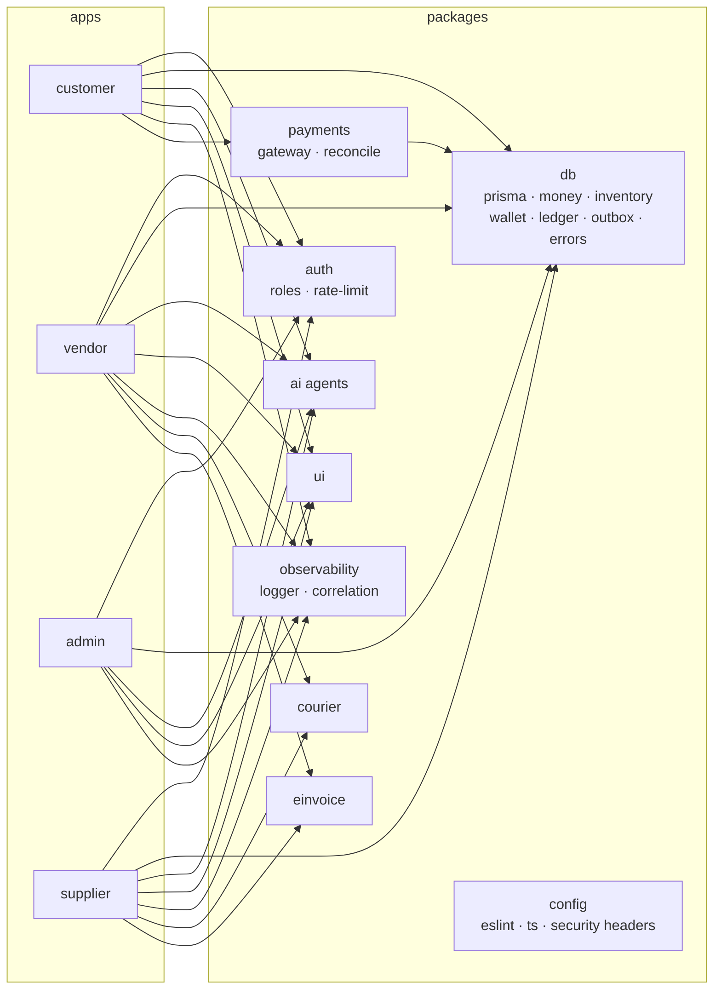
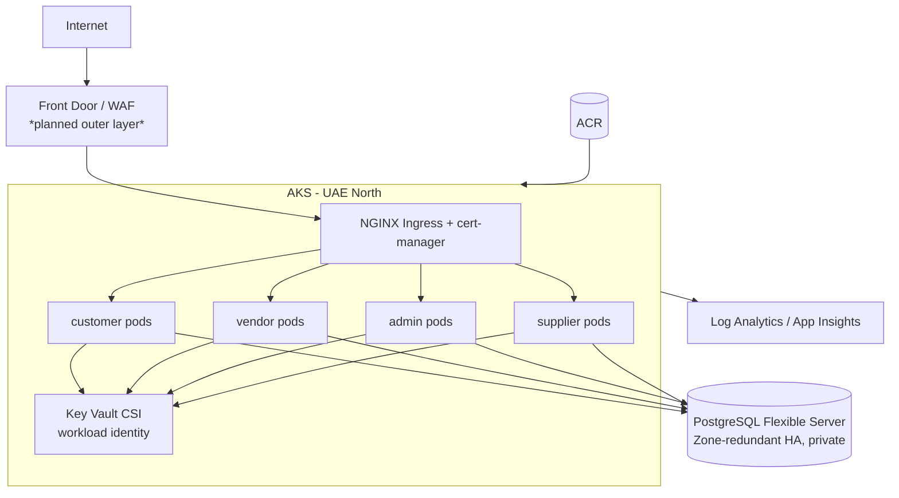
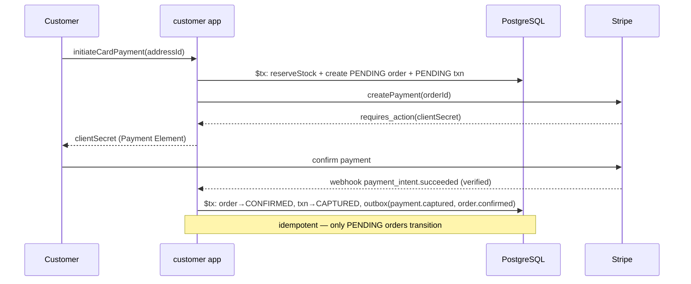
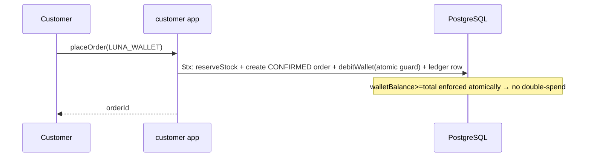
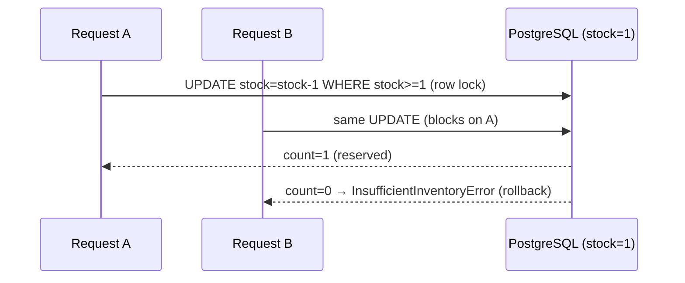
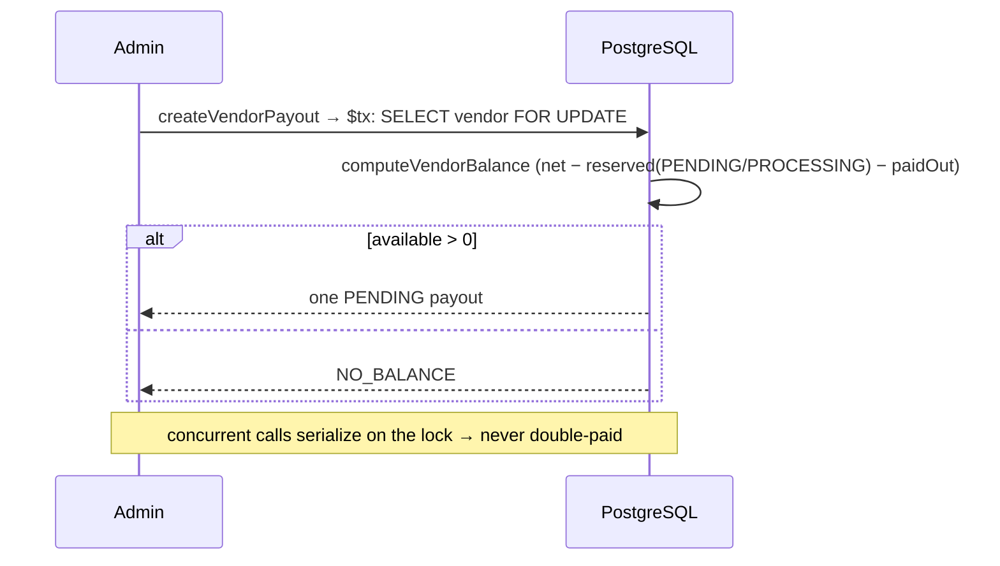
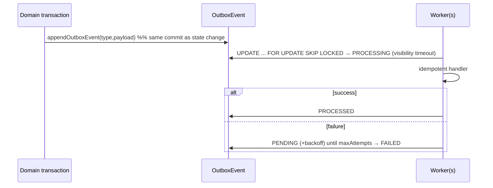

# e-Luna — Architecture

This document describes the e-Luna platform architecture as it stands after the production-hardening
effort (see `docs/PRODUCTION-HARDENING.md` and PRs #1–#4). Diagrams are Mermaid so they render on
GitHub and stay in-repo next to the code.

- **Style:** modular monolith — a Turborepo of four Next.js 15 apps sharing typed packages. Strong
  internal module boundaries; not split into microservices (see ADR-0001).
- **Personas / apps:** `customer` (luna.ae), `vendor` (sell.luna.ae), `admin` (ops.luna.ae),
  `supplier` (supply.luna.ae).
- **Shared packages:** `ui`, `db` (Prisma + domain services), `ai`, `auth`, `config`, `payments`,
  `courier`, `einvoice`, `observability`.

---

## 1. System context



External integrations are **credential-gated and fail closed**: absent real credentials, providers
either are hidden from the UI or fall back to a Simulated adapter that is forbidden from "capturing"
in production (see ADR-0002).

---

## 2. Container / component architecture



Domain/financial logic lives in `@e-luna/db` (money, inventory reservation, wallet ledger, financial
ledger, order/payment/payout state machines, outbox, typed errors) so it is unit/integration-tested
independently of the Next.js layer. Server actions stay thin: authenticate → validate → call a
service → map result.

---

## 3. Deployment architecture (Azure)



All four apps are built (multi-stage Dockerfile, non-root) and deployed via one Helm chart with
per-app Deployment/Service/Ingress/HPA/PDB, `runAsNonRoot` + dropped capabilities, and split
liveness (`/api/health/live`) / readiness (`/api/health/ready`, DB-checked) probes. A CI guard
(`scripts/check-deploy-parity.mjs`) fails the build if any app is missing from deploy config.

---

## 4. Checkout & payment sequences

### Card (async, order-first)



### Wallet (synchronous, atomic)



COD creates a CONFIRMED order but leaves the payment **PENDING** until cash is collected.

### Inventory reservation (no oversell)



### Payout (race-safe)



### Refund

```mermaid
sequenceDiagram
  participant Vendor
  participant GW as Gateway
  participant DB as PostgreSQL
  Vendor->>DB: refundReturn — computeRefundBreakdown (bound ≤ captured; split net/commission)
  alt payment CAPTURED
    Vendor->>GW: refund(gross)  %% money first, abort on failure
    GW-->>Vendor: ok
  end
  Vendor->>DB: $tx: return→REFUNDED, item→RETURNED, restock?, txn→(PARTIALLY_)REFUNDED, ledger REFUND+COMMISSION, audit
```

---

## 5. Reliability — transactional outbox



---

## 6. Security & observability

- **AuthN:** Clerk (per-app instance); `getAuthUser()` reads role/vendorId/supplierId only from
  trusted server-side session claims.
- **AuthZ:** every server action re-checks role AND resource ownership (`where: { id, vendorId }` /
  post-load owner check) — audited, no horizontal privilege escalation (see THREAT-MODEL).
- **Headers:** shared HSTS/nosniff/frame-ancestors/Referrer-Policy/Permissions-Policy on all apps.
- **Rate limiting:** `@e-luna/auth` limiter on AI endpoints (Redis-swappable interface).
- **Audit log:** immutable `AuditLog`, written transactionally for payout/vendor/refund actions.
- **Observability:** `@e-luna/observability` structured JSON logger with correlation IDs + secret
  redaction; adopted in checkout + webhook (rollout ongoing).

See `docs/adr/` for the decisions behind these, and `docs/PRODUCTION-HARDENING.md` for status.
